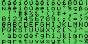

# Kaypro disassembled and commented

## Elements analysed

[ROMS](rom):

- [81-149c](81-149c.s), downloaded from [Retroarchive](http://www.retroarchive.org/maslin/disks/roms/index.html)
- [81-232](81-232.s), dumped from my Kaypro

[CP/M BIOS](bios):

- [CP/M 2.2 US](bios/bios_us.us)
- CP/M 2.2 Spanish (Work in progress): Has translated versions of the warm boot message and does the character translation for the Spanish keyboard

[Executables](executables)

- [cambio.com](executable/cambio.s): Privided by the CP/M in Spanish to select how the BIOS behaves
- [cambio8.com](executable/cambio8.s): Privided by the CP/M in Spanish to select how the BIOS behaves

[Character generators](chars)

- 81-146a: Kapyro II/83, downloaded from [Retroarchive](http://www.retroarchive.org/maslin/disks/roms/index.html)
- 81-234: Kaypro II/83 International version, dumped from my Kaypro with Spanish keyboard. Replaces the Greek chars with the extra European latin chars
- 81-187: Kaypro 10, higher resolution
- 81-235: Kaypro 2/84, higher resolution, identical to 81-187

## References

- [Kaypro II Theory of Operation](documentation/Kaypro%20II%20Theory%20of%20Operation%201983.pdf)
- [CP/M 2.2 Alteration Guide](documentation/CPM_2.2_Alteration_Guide_1979.pdf)
- [FD179X-02 Datasheet](documentation/FD179X-02_Data_Sheet_May1980.pdf)
- [Zilog Z80-PIO Technical Manual](documentation/Zilog%20Z80-PIO%20Technical%20Manual.pdf)
- [Zilog Z80-SIO Technical Manual](documentation/Zilog%20Z80-SIO%20Technical%20Manual.pdf)

