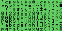
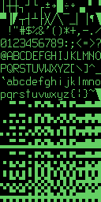

# Kaypro character generators

Versions:

- 81-146a: Kapyro II/83, downloaded from [Retroarchive](http://www.retroarchive.org/maslin/disks/roms/index.html)
- 81-234: Kaypro II/83 International version, dumped from my Kaypro with Spanish keyboard. Replaces the Greek chars with the extra European latin chars
- 81-187: Kaypro 10, higher resolution
- 81-235: Kaypro 2/84, higher resolution, identical to 81-187

## 81-146a

## 81-234

## 81-187

## 81-235

